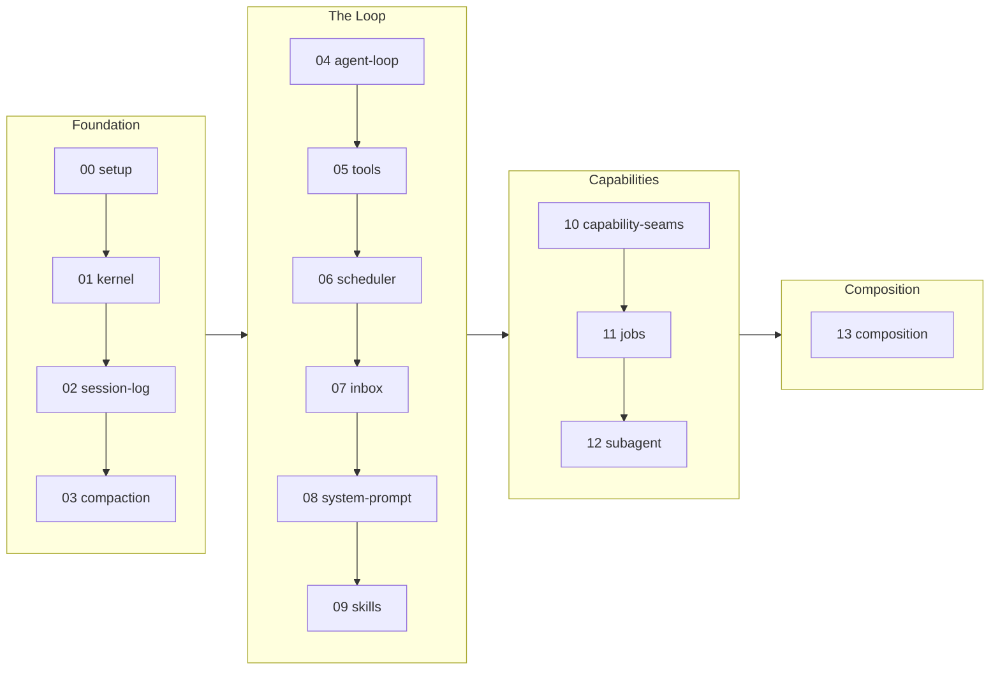

<div align="center">

# learn-deepseek-harness

**Everything is a plugin: rebuild DeepSeek Harness from scratch.**

[](https://github.com/deepseek-ai/deepseek-harness/tree/99f6f02fecdb7dff40c3fbc9470f5907c29f74ca)
[](LICENSE)

English | [繁體中文](README.zh-TW.md) | [简体中文](README.zh-CN.md)

</div>

[DeepSeek Harness](https://github.com/deepseek-ai/deepseek-harness) (dsh) is a real agent harness: a large TypeScript codebase built on Cordis, where everything is a plugin. Reading it cold is hard because its design ideas are spread across many packages.

This tutorial takes the other route. You rebuild a minimal version, Mini-dsh, in plain stdlib Python across 14 Sections in 4 Phases. Each Section adds exactly one Mechanism, proves it with a deterministic Offline check, and points back to where the real dsh implements it, pinned at the Studied version above.

**Contents**: [Big picture](#big-picture) · [How to learn](#how-to-learn) · [Sections](#sections) · [Repository structure](#repository-structure) · [Running](#running) · [Contributing](#contributing) · [References](#references)

## Big picture



One rule carries through every Section, because it is the rule the real system is built on:

> Everything is a plugin, and every registration is reversible.

## How to learn

Every Section reads through the same 4-part Lens:

1. **Opening**: the one design question this Section answers, before any code.
2. **Mechanism**: the moving parts you build, with excerpts and a flow diagram.
3. **In real dsh**: a table mapping your Mini-dsh symbols to the real dsh symbols, with links pinned to the Studied version, plus what the real system adds that the rebuild omits (the Ceiling).
4. **Failure modes**: what breaks without the Mechanism, not just what works with it.

Read the Sections in order: each one carries the previous `src/` forward verbatim and adds one Mechanism (Carry-forward). Run each Section's Offline check as you go. To see a Mechanism in isolation, diff adjacent `src/` directories: the diff is exactly the Mechanism.

## Sections

| # | Section | Design question | Mechanism |
|---|---------|-----------------|-----------|
| | **Foundation** | | |
| 00 | [Setup](sections/00-setup/) | why does mini-dsh's core speak its own Message shape through a swappable Model seam? | provider-agnostic `Message`, streaming Model seam, Scripted stand-in |
| 01 | [Kernel](sections/01-kernel/) | why can the framework unload a plugin correctly, rather than per-plugin cleanup? | fiber/effect reversible registrations |
| 02 | [Session log](sections/02-session-log/) | why derive model history from a log instead of storing a message list? | append-only log + surface + deriveMessages |
| 03 | [Compaction](sections/03-compaction/) | if the log is append-only, how does compaction remove anything the model sees? | surface `replace` op |
| | **The Loop** | | |
| 04 | [Agent loop](sections/04-agent-loop/) | why re-assemble the prompt and re-derive history every step? | turn/step machine, log = only durable state |
| 05 | [Tools](sections/05-tools/) | why does a denied/errored call still produce a normal tool/result? | scoped registry + pre/ask/guard/execute/post pipeline |
| 06 | [Scheduler](sections/06-scheduler/) | why do parallel-safe calls overlap, exclusive calls form barriers, and aborted-unstarted calls get synthetic results? | 4-stage parallel tool scheduler |
| 07 | [Inbox](sections/07-inbox/) | why two inbox targets, and why claim only at step boundaries? | next-turn/next-step steering |
| 08 | [System prompt](sections/08-system-prompt/) | why is dynamic state a re-emitted user message rather than system text? | ordered providers -> system text + tool list + runtime-context snapshot |
| 09 | [Skills](sections/09-skills/) | why inject a catalog as context but load bodies through a tool call? | layered provider registry; catalog injected, bodies on demand |
| | **Capabilities** | | |
| 10 | [Capability seams](sections/10-capability-seams/) | when does a capability earn the three-way split? | Definition/Provider/Consumer ABCs (fs/shell/sandbox/llm) |
| 11 | [Jobs](sections/11-jobs/) | who owns cancellation once the job id is published? | owner-fenced background-work protocol |
| 12 | [Subagent](sections/12-subagent/) | why an interface over "establish a child, hand back a run", not a subclassed agent? | named-provider delegation registry |
| | **Composition** | | |
| 13 | [Composition](sections/13-composition/) | why is a patch a whole-config replace, not a deep merge? | ordered patch layers over an empty entry list |

## Repository structure

```text
learn-deepseek-harness/
├── README.md
├── LICENSE
├── requirements.txt     # live demos only: anthropic, python-dotenv
├── .env.example         # ANTHROPIC_API_KEY / ANTHROPIC_MODEL / optional base URL
└── sections/
    ├── 00-setup/
    │   ├── README.md
    │   └── src/         # message.py, standin.py, test.py
    ├── 01-kernel/
    │   ├── README.md
    │   └── src/         # 00's src verbatim + kernel.py, test.py
    ├── ...
    └── 13-composition/
        ├── README.md
        └── src/         # 12's src verbatim + this Mechanism, test.py, demo.py
```

## Running

The Offline checks are the tutorial's proof. They are stdlib-only: nothing to install, no API key, no network, deterministic output.

```bash
python sections/00-setup/src/test.py     # one section
for t in sections/*/src/test.py; do python "$t" || break; done   # all sections
```

Model-touching Sections (04 and later) also ship a Live demo that runs scripted turns against the real Anthropic API. It skips politely if no key is set.

```bash
pip install -r requirements.txt
cp .env.example .env   # then fill in ANTHROPIC_API_KEY
python sections/04-agent-loop/src/demo.py
```

## Contributing

- **Deepen a Section**: a sharper excerpt, a better failure mode, a tighter check for an existing Mechanism.
- **Correct the record**: a mini-to-real mapping or claim about dsh that the pinned source contradicts.

## References

- [Cordis primer](https://github.com/deepseek-ai/deepseek-harness/blob/99f6f02fecdb7dff40c3fbc9470f5907c29f74ca/docs/cordis-primer.md): dsh's own intro to the plugin runtime it is built on.
- [Cordis tutorial](https://github.com/deepseek-ai/deepseek-harness/tree/99f6f02fecdb7dff40c3fbc9470f5907c29f74ca/docs/cordis-tutorial): writing real dsh plugins; this tutorial defers all plugin-authoring how-to there.
- [Subsystem docs](https://github.com/deepseek-ai/deepseek-harness/tree/99f6f02fecdb7dff40c3fbc9470f5907c29f74ca/docs/subsystems): per-subsystem design docs, the counterpart of each Section's In-real-dsh slot.
- [cordiverse/cordis](https://github.com/cordiverse/cordis): the upstream framework dsh vendors.
