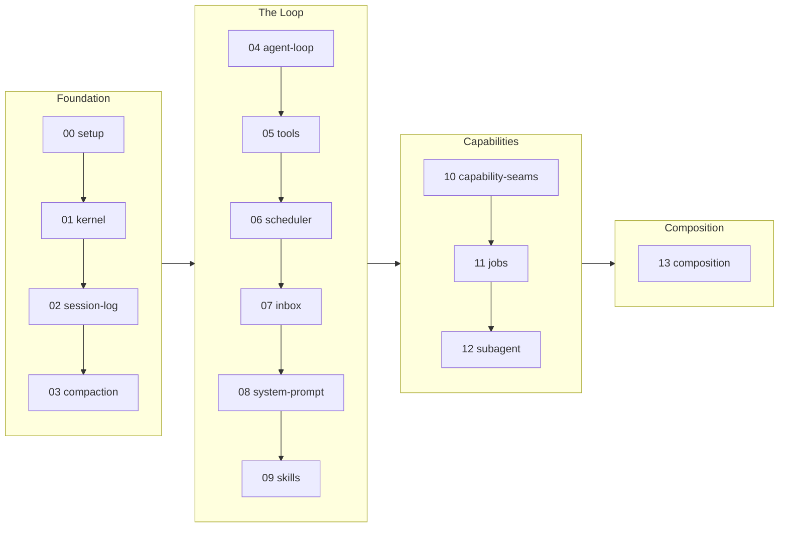

<!-- source: README.md @ 75b51d8 -->

<div align="center">

# learn-deepseek-harness

**一切都是 plugin：从零重建 DeepSeek Harness。**

[](https://github.com/deepseek-ai/deepseek-harness/tree/99f6f02fecdb7dff40c3fbc9470f5907c29f74ca)
[](LICENSE)

[English](README.md) | [繁體中文](README.zh-TW.md) | 简体中文

</div>

[DeepSeek Harness](https://github.com/deepseek-ai/deepseek-harness)（dsh）是一套真的 agent harness：一份建在 Cordis 上面的大型 TypeScript 代码库，里面每一样东西都是 plugin。直接读源代码很吃力，因为它的设计想法散在很多包里。

这份 tutorial 走另一条路。你用纯标准库的 Python，跨 4 个 Phase、14 个 Section，重建一个最小版本 Mini-dsh。每个 Section 只加一个 Mechanism，用一个结果固定的 Offline check 证明它会动，再指回真正的 dsh 在哪里实现它，全部钉在上面那个 Studied version。

**目录**：[全貌](#全貌) · [怎么读](#怎么读) · [Sections](#sections) · [项目结构](#项目结构) · [怎么跑](#怎么跑) · [怎么参与](#怎么参与) · [延伸阅读](#延伸阅读)

## 全貌



有一条规则贯穿每个 Section，因为真正的系统就是照这条规则盖起来的：

> 一切都是 plugin，而且每一次注册都可以反向撤销。

## 怎么读

每个 Section 都照同一套四个部分的 Lens 来读：

1. **Opening**：这个 Section 要回答的那一个设计问题，在任何代码之前。
2. **Mechanism**：你要盖的那些零件，配上代码片段和一张流程图。
3. **In real dsh**：一张把你的 Mini-dsh 符号对到真 dsh 符号的表，链接全部钉在 Studied version 上，再加上真系统有做、而重建版没做的部分，也就是 Ceiling。
4. **Failure modes**：少了这个 Mechanism 会坏掉什么，而不只是有了它会动什么。

Section 请照顺序读：每一个都把前一个的 `src/` 原封不动搬过来，只加一个 Mechanism，这就是 Carry-forward。读到哪里就顺手跑那个 Section 的 Offline check。想单独看清楚一个 Mechanism，就去 diff 相邻两个 `src/` 目录：那份 diff 刚好就是那个 Mechanism。

## Sections

| # | Section | 设计问题 | Mechanism |
|---|---------|-----------------|-----------|
| | **Foundation** | | |
| 00 | [Setup](sections/00-setup/) | 为什么每个 Section 的检查都得离线跑在 stand-in 上？ | repo 骨架、runner、model stand-in 的 seam |
| 01 | [Kernel](sections/01-kernel/) | 为什么是框架有办法正确卸载一个 plugin，而不是每个 plugin 自己收尾？ | fiber/effect 可反向撤销的注册 |
| 02 | [Session log](sections/02-session-log/) | 为什么要从一份 log 推导出 model 看到的历史，而不是直接存一份消息列表？ | 只能追加的 log + surface + deriveMessages |
| 03 | [Compaction](sections/03-compaction/) | 如果 log 只能追加，compaction 要怎么拿掉 model 看得到的东西？ | surface 的 `replace` 操作 |
| | **The Loop** | | |
| 04 | [Agent loop](sections/04-agent-loop/) | 为什么每一个 step 都要重组 prompt、重推一次历史？ | turn/step 状态机，log 是唯一持久的状态 |
| 05 | [Tools](sections/05-tools/) | 为什么被拒绝或出错的调用，还是会产生一条正常的 tool/result？ | 有作用域的 registry + pre/ask/guard/execute/post pipeline |
| 06 | [Scheduler](sections/06-scheduler/) | 为什么并行安全的调用会互相重叠，互斥的调用会形成屏障，而还没开始就被中止的调用会拿到一个合成的结果？ | 四阶段的并行 tool scheduler |
| 07 | [Inbox](sections/07-inbox/) | 为什么 inbox 要有两个投递目标，而且只在 step 的边界认领？ | next-turn/next-step 两种引导 |
| 08 | [System prompt](sections/08-system-prompt/) | 为什么动态状态是一条重新发出的 user 消息，而不是写进 system 文本里？ | 有顺序的 provider -> system 文本 + tool 列表 + runtime-context 快照 |
| 09 | [Skills](sections/09-skills/) | 为什么列表是当成 context 注入，内容却要靠一次 tool 调用才加载进来？ | 分层的 provider registry；列表先注入，内容按需加载 |
| | **Capabilities** | | |
| 10 | [Capability seams](sections/10-capability-seams/) | 一个能力要到什么时候才值得拆成三份？ | Definition/Provider/Consumer 三个抽象基类（fs/shell/sandbox/llm） |
| 11 | [Jobs](sections/11-jobs/) | job id 一旦公开出去，取消的权责归谁？ | 以拥有者为界的后台工作协议 |
| 12 | [Subagent](sections/12-subagent/) | 为什么接口是架在“开一个 child、交回一次 run”上面，而不是继承出一个 agent 子类？ | 具名 provider 的委派 registry |
| | **Composition** | | |
| 13 | [Composition](sections/13-composition/) | 为什么一个 patch 是整份 config 的替换，而不是深层合并？ | 在一份空的 entry 列表上叠有顺序的 patch 层 |

## 项目结构

```text
learn-deepseek-harness/
├── README.md
├── LICENSE
├── requirements.txt     # live demos only: anthropic, python-dotenv
├── .env.example         # ANTHROPIC_API_KEY / ANTHROPIC_MODEL / optional base URL
└── sections/
    ├── 00-setup/
    │   ├── README.md
    │   └── src/         # message.py, standin.py, test.py
    ├── 01-kernel/
    │   ├── README.md
    │   └── src/         # 00's src verbatim + kernel.py, test.py
    ├── ...
    └── 13-composition/
        ├── README.md
        └── src/         # 12's src verbatim + this Mechanism, test.py, demo.py
```

## 怎么跑

Offline check 就是这份 tutorial 的证明。它们只用标准库：不用装东西、不用 API key、不用网络，输出每次都一样。

```bash
python sections/00-setup/src/test.py     # one section
for t in sections/*/src/test.py; do python "$t" || break; done   # all sections
```

会碰到 model 的 Section（04 以后）另外附一个 Live demo，拿写好的 turn 去打真正的 Anthropic API。没设 key 的话它会安静跳过。

```bash
pip install -r requirements.txt
cp .env.example .env   # then fill in ANTHROPIC_API_KEY
python sections/04-agent-loop/src/demo.py
```

## 怎么参与

- **把某个 Section 挖深**：更精准的代码片段、更好的 failure mode、给既有 Mechanism 一个更紧的检查。
- **纠正错误**：mini 对到真 dsh 的对照，或任何关于 dsh 的说法，只要钉住的源代码跟它对不上。

## 延伸阅读

- [Cordis primer](https://github.com/deepseek-ai/deepseek-harness/blob/99f6f02fecdb7dff40c3fbc9470f5907c29f74ca/docs/cordis-primer.md)：dsh 自己写的入门，介绍它建在上面的那套 plugin runtime。
- [Cordis tutorial](https://github.com/deepseek-ai/deepseek-harness/tree/99f6f02fecdb7dff40c3fbc9470f5907c29f74ca/docs/cordis-tutorial)：怎么写真正的 dsh plugin；这份 tutorial 把所有写 plugin 的操作细节都交给它。
- [Subsystem docs](https://github.com/deepseek-ai/deepseek-harness/tree/99f6f02fecdb7dff40c3fbc9470f5907c29f74ca/docs/subsystems)：每个子系统一份的设计文档，对应到每个 Section 的 In-real-dsh 那一格。
- [cordiverse/cordis](https://github.com/cordiverse/cordis)：dsh 内嵌的上游框架。
