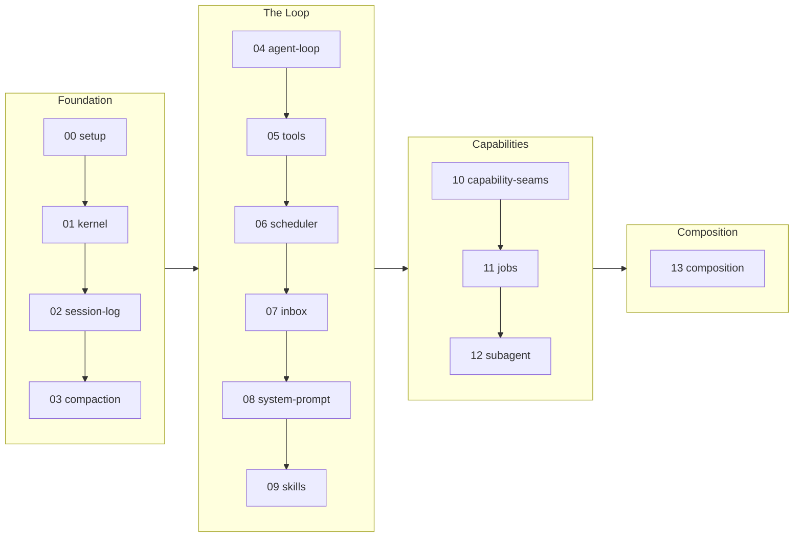

<!-- source: README.md @ 9275a92 -->

<div align="center">

# learn-deepseek-harness

**一切都是 plugin：從零重建 DeepSeek Harness。**

[](https://github.com/deepseek-ai/deepseek-harness/tree/99f6f02fecdb7dff40c3fbc9470f5907c29f74ca)
[](LICENSE)

[English](README.md) | 繁體中文 | [简体中文](README.zh-CN.md)

</div>

[DeepSeek Harness](https://github.com/deepseek-ai/deepseek-harness)（dsh）是一套貨真價實的 agent harness：一個建在 Cordis 上的大型 TypeScript 程式碼庫，裡面每一樣東西都是 plugin。第一次讀它的原始碼會很吃力，因為它的設計想法散落在很多套件裡。

這份 tutorial 走另一條路。你只用 Python 標準函式庫，跨 4 個 Phase、14 個 Section，重建一個最小版本，叫做 Mini-dsh。每個 Section 只加一個 Mechanism，用一支每次結果都一樣的 Offline check 證明它會動，再帶你去看真正的 dsh 是在哪裡實作這件事的，所有指過去的連結都固定在上面那個 Studied version。

**目錄**：[全貌](#全貌) · [怎麼讀](#怎麼讀) · [Sections](#sections) · [專案結構](#專案結構) · [怎麼跑](#怎麼跑) · [怎麼參與](#怎麼參與) · [延伸閱讀](#延伸閱讀)

## 全貌



有一條規則貫穿每個 Section，因為真正的系統就是建立在這條規則之上：

> 一切都是 plugin，而且每一次註冊都可以反向撤銷。

## 怎麼讀

每個 Section 都用同一套 Lens 來讀，固定四個部分：

1. **Opening**：還沒碰到任何程式碼之前，先講清楚這個 Section 要回答的那一個設計問題。
2. **Mechanism**：你要動手做出來的那些零件，配上程式碼片段和一張流程圖。
3. **In real dsh**：一張對照表，把你寫的 Mini-dsh 符號對到真 dsh 的符號，每個連結都固定在 Studied version 上；後面再補上真系統有做、而重建版沒做的那些部分，也就是 Ceiling。
4. **Failure modes**：少了這個 Mechanism 會壞掉什麼，而不是只講有了它會動什麼。

Section 要照順序讀：每一個都把前一個的 `src/` 原封不動搬過來，然後只加一個 Mechanism，這就是 Carry-forward。讀到哪個 Section，就順手把它的 Offline check 跑一遍。想單獨看清楚某一個 Mechanism，就 diff 相鄰的兩個 `src/` 目錄：跑出來的 diff 剛好就是那個 Mechanism。

## Sections

| # | Section | 設計問題 | Mechanism |
|---|---------|-----------------|-----------|
| | **Foundation** | | |
| 00 | [Setup](sections/00-setup/README.zh-TW.md) | 為什麼 mini-dsh 的核心只認自己那套 Message 格式，而且一定要隔著一個隨時換得掉的 Model seam 才去問 model？ | 不綁 provider 的 `Message`、會串流的 Model seam、Scripted stand-in |
| 01 | [Kernel](sections/01-kernel/README.zh-TW.md) | 為什麼卸載一個 plugin 這件事，能交給框架做對，而不是每個 plugin 自己收尾？ | 可反向撤銷的 fiber/effect 註冊 |
| 02 | [Session log](sections/02-session-log/README.zh-TW.md) | 為什麼要從一份 log 推導出 model 看到的歷史，而不是直接存一份訊息清單？ | 只能追加的 log + surface + deriveMessages |
| 03 | [Compaction](sections/03-compaction/README.zh-TW.md) | 如果 log 只能追加，compaction 要怎麼拿掉 model 看得到的東西？ | surface 的 `replace` 操作 |
| | **The Loop** | | |
| 04 | [Agent loop](sections/04-agent-loop/README.zh-TW.md) | 為什麼每一個 step 都要重新組一次 prompt、重新推一次歷史？ | turn/step 狀態機，log 是唯一持久的狀態 |
| 05 | [Tools](sections/05-tools/README.zh-TW.md) | 為什麼被拒絕或出錯的呼叫，還是會產生一則正常的 tool/result？ | 有作用域的 registry + pre/ask/guard/execute/post pipeline |
| 06 | [Scheduler](sections/06-scheduler/README.zh-TW.md) | 為什麼可以平行跑的呼叫會疊在一起跑，互斥的呼叫會卡成一道關卡，而還沒開始就被中止的呼叫會拿到一個合成出來的結果？ | 四階段的平行 tool scheduler |
| 07 | [Inbox](sections/07-inbox/README.zh-TW.md) | 為什麼 inbox 要有兩個投遞目標，而且只在 step 的邊界認領？ | next-turn/next-step 兩種介入時機 |
| 08 | [System prompt](sections/08-system-prompt/README.zh-TW.md) | 為什麼動態狀態是一則重新發出的 user 訊息，而不是寫進 system 文字裡？ | 照順序跑的 provider -> system 文字 + tool 清單 + runtime-context 快照 |
| 09 | [Skills](sections/09-skills/README.zh-TW.md) | 為什麼 skill 清單是當成 context 注入，內容卻要靠一次 tool 呼叫才載進來？ | 分層的 provider registry；清單先注入，內容按需載入 |
| | **Capabilities** | | |
| 10 | [Capability seams](sections/10-capability-seams/README.zh-TW.md) | 一個能力要到什麼時候才值得拆成三份？ | Definition/Provider/Consumer 三個抽象基底類別（fs/shell/sandbox/llm） |
| 11 | [Jobs](sections/11-jobs/README.zh-TW.md) | job id 一旦公開出去，取消的權責歸誰？ | 只有擁有者能動的背景工作協定 |
| 12 | [Subagent](sections/12-subagent/README.zh-TW.md) | 為什麼介面是架在「開一個 child、交回一次 run」上面，而不是繼承出一個 agent 子類別？ | 具名 provider 的委派 registry |
| | **Composition** | | |
| 13 | [Composition](sections/13-composition/README.zh-TW.md) | 為什麼一個 patch 是整份 config 的替換，而不是深層合併？ | 在一份空的 entry 清單上，照順序疊 patch 層 |

## 專案結構

```text
learn-deepseek-harness/
├── README.md
├── LICENSE
├── requirements.txt     # live demos only: anthropic, python-dotenv
├── .env.example         # ANTHROPIC_API_KEY / ANTHROPIC_MODEL / optional base URL
└── sections/
    ├── 00-setup/
    │   ├── README.md
    │   └── src/         # message.py, standin.py, test.py
    ├── 01-kernel/
    │   ├── README.md
    │   └── src/         # 00's src verbatim + kernel.py, test.py
    ├── ...
    └── 13-composition/
        ├── README.md
        └── src/         # 12's src verbatim + this Mechanism, test.py, demo.py
```

## 怎麼跑

這份 tutorial 講的每件事，都由 Offline check 來證明。它們只用標準函式庫：不用裝東西、不用 API key、不用網路，輸出每次都一樣。

```bash
python sections/00-setup/src/test.py     # one section
for t in sections/*/src/test.py; do python "$t" || break; done   # all sections
```

會碰到 model 的 Section（04 以後）另外附一支 Live demo，拿寫好的 turn 去呼叫真正的 Anthropic API。沒設 key 的話，它會安靜地跳過。

```bash
pip install -r requirements.txt
cp .env.example .env   # then fill in ANTHROPIC_API_KEY
python sections/04-agent-loop/src/demo.py
```

## 怎麼參與

- **把某個 Section 挖深**：更精準的程式碼片段、更好的 failure mode、給既有的 Mechanism 一支更嚴謹的檢查。
- **糾正錯誤**：只要鎖定的那版原始碼跟它對不上，不管是 mini 對到真 dsh 的對照，還是任何關於 dsh 的說法，都歡迎指出來。

## 延伸閱讀

- [Cordis primer](https://github.com/deepseek-ai/deepseek-harness/blob/99f6f02fecdb7dff40c3fbc9470f5907c29f74ca/docs/cordis-primer.md)：dsh 自己寫的入門文，介紹它底下那套 plugin runtime。
- [Cordis tutorial](https://github.com/deepseek-ai/deepseek-harness/tree/99f6f02fecdb7dff40c3fbc9470f5907c29f74ca/docs/cordis-tutorial)：教你怎麼寫真正的 dsh plugin。這份 tutorial 把所有寫 plugin 的操作細節都交給它。
- [Subsystem docs](https://github.com/deepseek-ai/deepseek-harness/tree/99f6f02fecdb7dff40c3fbc9470f5907c29f74ca/docs/subsystems)：每個子系統各一份設計文件，對應的就是每個 Section 的 In-real-dsh 那一格。
- [cordiverse/cordis](https://github.com/cordiverse/cordis)：dsh 內嵌進來的上游框架。
