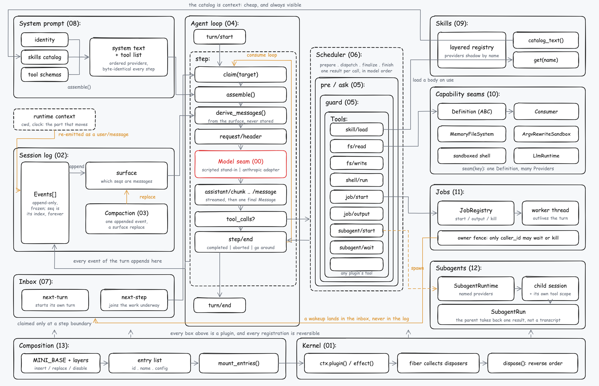

<!-- source: README.md @ 3705bd7 -->

<div align="center">

# learn-deepseek-harness

**一切皆為 plugin：從零拆解並重建 DeepSeek Harness。**

[](https://github.com/deepseek-ai/deepseek-harness/tree/99f6f02fecdb7dff40c3fbc9470f5907c29f74ca)
[](LICENSE)

[English](README.md) | 繁體中文 | [简体中文](README.zh-CN.md)

<video src="https://github.com/user-attachments/assets/044d258b-7e3a-4448-b0b0-224bd6c504fa" controls width="800"></video>

</div>

[DeepSeek Harness](https://github.com/deepseek-ai/deepseek-harness)（dsh）是一套建立在 Cordis 上的 agent harness。它是個龐大的 TypeScript 專案，從工具到完整子系統都以 plugin 組成。如果一開始就直接讀原始碼，很容易迷失在各個套件之間，因為核心設計分散在整個程式碼庫中。

這份教學換一種讀法：只用 Python 標準函式庫，分成 4 個階段、14 個章節，逐步實作一個最小版本 Mini-dsh。每章只加入一項核心機制，再用離線測試驗證行為，最後對照真正的 dsh 如何實作。

**目錄**：[架構概覽](#架構概覽) · [閱讀方式](#閱讀方式) · [章節索引](#章節索引) · [專案結構](#專案結構) · [執行方式](#執行方式) · [參與貢獻](#參與貢獻) · [延伸閱讀](#延伸閱讀)

## 架構概覽

這張圖彙整了 Mini-dsh 的整體架構。kernel 負責掛載與卸載 plugin，loop 負責推進 agent 流程，任何需要存取 log 以外資源的操作，都必須經過明確的能力介面（seam）。



> 一切都是 plugin，每一次註冊也都能完整撤銷。

## 閱讀方式

每一章都沿用相同的分析架構，固定分成四個部分：

1. **開場**：先不看程式碼，直接說明本章要解決的設計問題。
2. **核心機制**：逐一拆解需要實作的元件，並搭配程式碼片段與流程圖說明。
3. **對照真正的 dsh**：將 Mini-dsh 的類別與函式，對應到真正 dsh 中的實作檔案。所有連結都固定在本教學研究的版本，並補充 Mini-dsh 為了保持精簡而沒有實作的功能。
4. **常見失敗模式**：解釋少了這項機制後，系統會在哪些地方出問題。

建議依序閱讀。每一章都會完整沿用前一章的 `src/`，只新增一項機制，這就是本教學的 Carry-forward 結構。讀完一章後，可以直接執行對應的離線測試。若想聚焦某項機制，只要比較前後兩章的 `src/` 目錄，diff 中的差異就是該章新增的內容。

## 章節索引

| # | 章節 | 設計問題 | 核心機制 |
|---|---------|-----------------|-----------|
| | **Foundation** | | |
| 00 | [Setup](sections/00-setup/README.zh-TW.md) | 為什麼核心只使用統一的 `Message` 格式，並透過可替換的 Model seam 呼叫模型？ | 不綁定 provider 的 `Message`、串流 Model seam、Scripted stand-in |
| 01 | [Kernel](sections/01-kernel/README.zh-TW.md) | 為什麼 plugin 的卸載與清理應由框架統一管理？ | 可反向撤銷的 fiber/effect 註冊 |
| 02 | [Session log](sections/02-session-log/README.zh-TW.md) | 為什麼模型歷史應從 log 推導，而不是另外儲存一份訊息清單？ | append-only log + surface + `derive_messages()` |
| 03 | [Compaction](sections/03-compaction/README.zh-TW.md) | 在 log 只能追加的情況下，compaction 如何縮小模型可見的歷史？ | surface 的 `replace` 操作 |
| | **The Loop** | | |
| 04 | [Agent loop](sections/04-agent-loop/README.zh-TW.md) | 為什麼每個 step 都要重新組裝 prompt，並從 log 推導歷史？ | turn/step 狀態機，log 是唯一可持久狀態 |
| 05 | [Tools](sections/05-tools/README.zh-TW.md) | 為什麼被拒絕或執行失敗的呼叫，仍然必須產生 `tool/result`？ | scoped registry + pre/ask/guard/execute/post pipeline |
| 06 | [Scheduler](sections/06-scheduler/README.zh-TW.md) | 為什麼並行安全的呼叫會重疊執行，互斥呼叫會形成 barrier，而取消後尚未開始的呼叫會收到合成結果？ | 四階段並行工具 scheduler |
| 07 | [Inbox](sections/07-inbox/README.zh-TW.md) | 為什麼 inbox 需要 `next-turn` 與 `next-step` 兩種目標，並只在 step 邊界認領？ | next-turn/next-step 兩種介入時機 |
| 08 | [System prompt](sections/08-system-prompt/README.zh-TW.md) | 為什麼動態狀態要以 user 訊息重新發送，而不是寫進 system prompt？ | 有順序的 provider -> system prompt + 工具清單 + runtime-context 快照 |
| 09 | [Skills](sections/09-skills/README.zh-TW.md) | 為什麼 skill 清單以 context 注入，完整內容卻由工具按需載入？ | 分層 provider registry；清單先注入，內容按需載入 |
| | **Capabilities** | | |
| 10 | [Capability seams](sections/10-capability-seams/README.zh-TW.md) | 一個能力在什麼情況下，才值得拆成 Definition、Provider 與 Consumer？ | Definition/Provider/Consumer 角色分離（fs/shell/sandbox/llm） |
| 11 | [Jobs](sections/11-jobs/README.zh-TW.md) | job id 公開後，誰擁有讀取、等待與取消它的權限？ | 只允許擁有者操作的背景工作協定 |
| 12 | [Subagent](sections/12-subagent/README.zh-TW.md) | 為什麼 subagent 介面是「啟動 child，回傳 run」，而不是繼承 `Agent`？ | 具名 provider 的委派 registry |
| | **Composition** | | |
| 13 | [Composition](sections/13-composition/README.zh-TW.md) | 為什麼 patch 會替換完整 config，而不是深層合併？ | 在空的 entry 清單上依序疊加 patch 層 |

## 專案結構

```text
learn-deepseek-harness/
├── README.md
├── LICENSE
├── requirements.txt     # live demos only: anthropic, python-dotenv
├── .env.example         # ANTHROPIC_API_KEY / ANTHROPIC_MODEL / optional base URL
├── assets/              # the architecture diagram, and the script that draws it
└── sections/
    ├── 00-setup/
    │   ├── README.md
    │   └── src/         # message.py, standin.py, test.py
    ├── 01-kernel/
    │   ├── README.md
    │   └── src/         # 00's src verbatim + kernel.py, test.py
    ├── ...
    └── 13-composition/
        ├── README.md
        └── src/         # 完整沿用第 12 章的 src，並加入本章機制、test.py、demo.py
```

## 執行方式

教學中的每項行為都有離線測試可驗證。這些測試只使用 Python 標準函式庫，不需安裝額外套件、API key 或網路，而且每次執行都會得到相同結果。

```bash
python sections/00-setup/src/test.py     # one section
for t in sections/*/src/test.py; do python "$t" || break; done   # all sections
```

從第 04 章開始，需要呼叫模型的章節也會提供實機示範，使用預先寫好的 turn 呼叫 Anthropic API。如果沒有設定 API key，示範會自動跳過，不會報錯。

```bash
pip install -r requirements.txt
cp .env.example .env   # then fill in ANTHROPIC_API_KEY
python sections/04-agent-loop/src/demo.py
```

## 參與貢獻

- **深化某個章節**：補上更精準的程式碼片段、更完整的失敗模式，或更嚴謹的測試。
- **修正內容**：如果 Mini-dsh 與真正 dsh 的對照有誤，或文中任何說法與鎖定版本的原始碼不一致，歡迎提出修正。

## 延伸閱讀

- [Cordis primer](https://github.com/deepseek-ai/deepseek-harness/blob/99f6f02fecdb7dff40c3fbc9470f5907c29f74ca/docs/cordis-primer.md)：dsh 自己寫的入門文，介紹它底下那套 plugin runtime。
- [Cordis tutorial](https://github.com/deepseek-ai/deepseek-harness/tree/99f6f02fecdb7dff40c3fbc9470f5907c29f74ca/docs/cordis-tutorial)：教你怎麼寫真正的 dsh plugin，這份 tutorial 把寫 plugin 的操作細節全都交給它。
- [Subsystem docs](https://github.com/deepseek-ai/deepseek-harness/tree/99f6f02fecdb7dff40c3fbc9470f5907c29f74ca/docs/subsystems)：每個子系統都有獨立的設計文件，可搭配各章的「對照真正的 dsh」段落閱讀。
- [cordiverse/cordis](https://github.com/cordiverse/cordis)：dsh 內嵌進來的上游框架。
